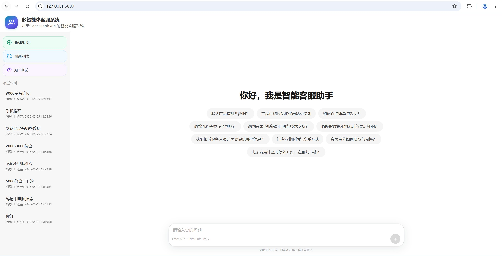
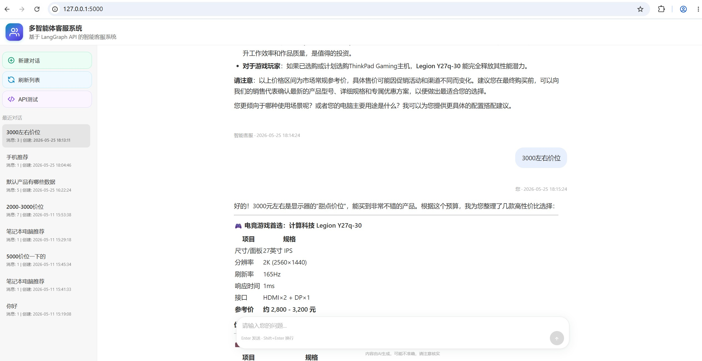
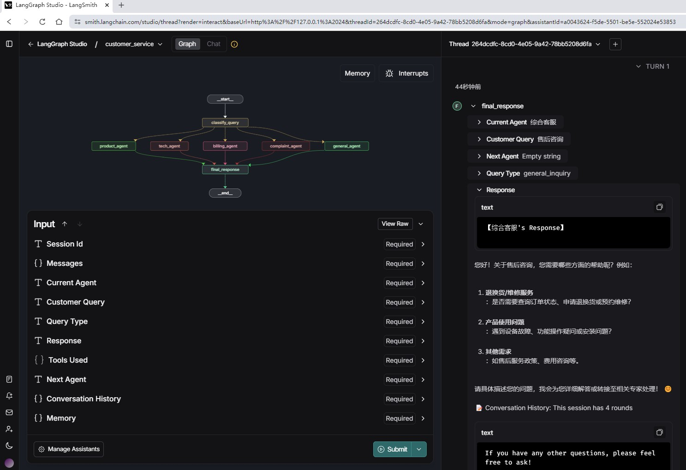

<h1 align="center">多智能体客服系统</h1>

<p align="center">
  <a href="LICENSE"></a>
  <a href="https://www.python.org/"></a>
  <a href="https://fastapi.tiangolo.com/"></a>
  <a href="https://python.langchain.com/"></a>
  <a href="https://github.com/langchain-ai/langgraph"></a>
</p>

<p align="center"><em>LLM 意图分类路由 · 5 个专家 Agent · 越界护栏 · FastAPI Web 前台 · LangGraph 会话编排</em></p>

## 项目概述

基于 LangGraph 构建的多智能体客服系统。一轮查询的处理链路是：

```
客户查询 → LLM 意图分类（6 类固定标签）→ 条件路由单分支分发 → 唯一专家 Agent
        → 本地关键词召回 → 拼上下文调用 LLM → 回复写入持久化轮次
```

分类器输出一个标签，图据此分发到**唯一**一个专家；标签无法归入客服业务范围时，
护栏分支直接返回固定话术并结束，不进入任何业务 Agent。

## 运行效果

### 首页



### 多轮对话



### 工作流



## 项目结构

```
customer-service-ai-agent/
├── multi_agents/                 # 智能体模块（Agent 一块）
│   ├── __init__.py
│   ├── base_agent.py             # 基类：统一 process 模板
│   ├── knowledge.py              # 本地召回层（关键词打分 + 片段渲染）
│   ├── product_agent.py
│   ├── tech_agent.py
│   ├── billing_agent.py
│   ├── complaint_agent.py
│   └── general_agent.py
├── workflow/                     # 流程模块（图编排一块）
│   ├── __init__.py
│   ├── graph.py                  # LangGraph 图定义（节点 / 条件边 / 路由表）
│   └── classifier.py             # 意图分类 + 标签归一化（图的固定第一跳）
├── data/knowledge/               # 领域知识数据（JSON）
│   ├── product.json  tech.json  billing.json
│   └── complaint.json  general.json
├── templates/index.html          # 单页前端
├── tests/                        # pytest（离线，打桩 requests 与 LLM）
│   ├── conftest.py
│   ├── test_classifier.py        # 标签归一化的脏输出用例
│   ├── test_routing.py           # 路由表与标签集一致性
│   ├── test_graph_e2e.py         # 图端到端行为
│   ├── test_agents.py            # Agent 模板方法与召回边界
│   ├── test_session_isolation.py # 会话隔离回归
│   └── test_web_api.py           # Web API 契约
├── config.py                     # 集中配置
├── chat_web_service.py           # LangGraph REST 调用与会话管理
├── web_app.py                    # FastAPI 路由
├── langgraph.json                # LangGraph 平台部署配置
├── pytest.ini
├── requirements.txt
├── requirements-dev.txt
└── README.md
```

## 主要特性

### 1. 意图分类路由 + 标签归一化

- LLM 分类器输出 6 类固定标签：`product_info` / `technical_support` / `billing` /
  `complaint` / `general_inquiry` / `out_of_scope`
- **标签归一化层**（`workflow/classifier.py`）处理模型的脏输出：带解释前缀
  （`分类结果：billing`）、带标点、带换行、大小写不一致、连字符变体
  （`technical-support`）。按标签长度降序做子串匹配，避免短标签抢走长标签
- 分类异常一律降级到 `general_inquiry`，**图执行不会中断**

### 2. 越界护栏

`out_of_scope` 分支直接返回固定话术并 `END`，不进入任何业务 Agent。
既省下一次 LLM 调用，也把这次拒绝写入持久化轮次，便于事后审计。

### 3. 模块化智能体设计

`BaseAgent` 用模板方法固定了处理链路（历史上下文 → 本地召回 → 拼消息 → 调 LLM → 写回状态），
子类只声明领域提示词与知识库名，新增一个专家约 20 行：

```python
class ProductAgent(BaseAgent):
    domain_prompt = "请根据客户查询提供专业、详细的产品信息……"
    knowledge_label = "产品信息"

    def __init__(self):
        super().__init__(name="产品专家", role="产品信息咨询和推荐",
                         expertise=["产品规格", "价格比较"], knowledge_file="product")
```

单轮固定 **2 次 LLM 调用**（分类 1 + 专家 1），由 `tests/test_graph_e2e.py` 守住。

### 4. 本地召回层（可替换）

知识库以 JSON 存放在 `data/knowledge/`，Agent 只依赖 `recall()` / `render()` 两个接口。
当前实现是关键词打分的确定性方案——召回结果可复现、可单测、零额外成本；
规模变大或需要语义泛化时换成向量检索，**不需要改动任何 Agent**。

无命中时返回空列表（**不做全库兜底**），保证召回层真的在缩小上下文。

### 5. 会话管理

- **会话隔离**：线程 ID 全程作为请求参数传递，**不存在任何"当前线程"模块级全局状态**。
  前端把服务端返回的 `thread_id` 回写并持续携带，因此不同浏览器/用户的会话互不干扰。
  这条约定由 `tests/test_session_isolation.py` 守住。
- **上下文感知**：每轮把最近 12 条对话按时间戳与角色拼进 prompt
- **记忆功能**：对话按结构化轮次（`content` / `is_user` / `timestamp`）写入图状态，
  由平台 checkpointer 持久化，跨进程可续聊
- **数据导出**：`GET /api/sessions/{id}/export` 返回完整对话 JSON 附件

## 质量保障

```bash
pip install -r requirements-dev.txt
pytest
```

**64 项测试，全部离线运行**（`requests` 已打桩，LLM 用可计数的假实现替换），
不需要 API Key、不产生任何调用费用。覆盖：

| 测试文件 | 守住什么 |
|---|---|
| `test_classifier.py` | 12 类脏输出的标签归一化；异常降级不抛错 |
| `test_routing.py` | 路由表与分类标签集**逐项一致**；图节点完整；图可重复构建 |
| `test_graph_e2e.py` | 单轮恰好 2 次 LLM 调用；护栏短路；空查询 0 次调用；多轮轮次累加；第二轮 prompt 真的带上了第一轮 |
| `test_agents.py` | 5 个 Agent 均挂载知识库；消息结构为「上下文 + 系统提示 + 查询」；召回精确且可复现；LLM 异常与未注入时返回兜底话术 |
| `test_session_isolation.py` | 两个客户端**永不共用线程**；模块内不存在共享线程状态；回传 thread_id 可续聊 |
| `test_web_api.py` | `/api/chat` 返回 `thread_id` / `agent` / `query_type`；错误状态码语义；导出附件；前端回写 thread_id 的静态检查 |

## 安装和配置

### 1. 安装依赖

```bash
pip install -r requirements.txt
pip install langgraph-cli
pip install -U "langgraph-cli[inmem]"
```

在 win 环境中，langgraph-cli 下载后需要将 `langgraph.exe` 路径加入 PATH 环境变量，
或使用时直接带全路径，例 `<your site-packages>\bin\langgraph.exe`。

### 2. 环境变量配置

复制 `env_example.txt` 为 `.env` 并填写。三处模型相关配置需自洽：

| 变量 | 默认值 | 说明 |
|---|---|---|
| `OPENAI_BASE_URL` | `https://api.siliconflow.cn/v1` | 服务商地址，兼容 OpenAI 规范即可 |
| `OPENAI_MODEL` | `Qwen/Qwen3-8B` | **模型名必须与服务商匹配**，换服务商时同步修改 |
| `OPENAI_API_KEY` | 空 | 密钥 |

> `.env` 已被 `.gitignore` 忽略，但请勿把含真实密钥的 `.env` 连同项目打包分享。

### 3. 图结构自检

```bash
python -m workflow.graph
```

会构建图、打印节点与路由表，并断言「路由表键集 == 分类标签集」——
两者一旦失配，某类查询会静默走到兜底分支，这条断言就是防线。

## 🚀 运行说明

### 方式1：使用 Studio UI 访问 LangGraph 服务

```bash
langgraph dev
```

启动后会自动拉起 LangSmith 服务，包含 LangStudio UI，默认 2024 端口。浏览器访问
`https://smith.langchain.com/studio/thread?render=interact&baseUrl=http://127.0.0.1:2024`

### 方式2：使用 Web 服务调用 LangGraph API

```bash
## 终端1：启动 LangGraph 服务
langgraph dev

## 终端2：启动自定义 Web 服务
python ./web_app.py
# 或使用 uvicorn 直启：
# uvicorn web_app:app --host 0.0.0.0 --port 5000
```

浏览器访问 `http://localhost:5000`，界面功能：

- **实时聊天**：输入问题，获得智能回复
- **智能体信息**：助手气泡内显示本轮的处理专家与查询类型
- **会话管理**：侧栏查看历史会话、切换会话、清空当前会话
- **数据导出**：`GET /api/sessions/{id}/export`（API 方式，返回 JSON 附件）

也可直接运行 `run.bat` 一键拉起两个服务。

### 方式3：直接 API 调用

接口文档默认在 `http://127.0.0.1:2024/docs`（内嵌 js，需要网络可达）。
也可参考 `https://langchain-ai.github.io/langgraph/cloud/reference/api/api_ref.html`

需要先 `langgraph dev` 启动 LangGraph 服务。

## 工作流程

1. **会话解析**：校验前端传入的 thread_id 是否真实存在；无效则新建线程
2. **查询分类**：LLM 判定查询类型并归一化标签
3. **护栏检查**：越界请求直接返回固定话术并结束
4. **上下文加载**：从持久化轮次中取最近对话，拼进 prompt
5. **智能体路由**：按标签单分支分发到唯一专家 Agent
6. **本地召回**：关键词命中领域知识，无命中则不注入
7. **专业处理**：专家 Agent 调用 LLM 生成回复
8. **状态写入**：用户轮次与助手轮次追加到 `persisted_dialogue`，由 checkpointer 持久化

### 工作流程图

```
客户查询 → 会话解析 → 查询分类 → 护栏检查 → 上下文加载 → 智能体路由 → 专业处理 → 响应
    ↓         ↓          ↓           ↓           ↓           ↓          ↓
  输入    线程校验    类型识别    越界拦截    历史加载    专家选择    专业解答
                                                 ↓
                                            状态持久化
```

### 状态管理

系统使用 `AgentState`（`TypedDict`，除 `customer_query` 外均可缺省）管理图状态：

| 字段 | 说明 |
|---|---|
| `customer_query` | 客户查询内容 |
| `query_type` | 查询类型标签 |
| `current_agent` | 当前处理智能体 |
| `response` | 智能体回复 |
| `tools_used` | 处理轨迹（分类 / 召回条数 / 护栏触发等） |
| `session_id` | 会话标识（与 thread_id 对齐） |
| `conversation_history` | 由 `persisted_dialogue` 派生的对话历史快照 |
| `persisted_dialogue` | **持久化载体**：结构化轮次列表，跨进程续聊的依据 |

## 关于模型服务

系统通过 OpenAI 兼容规范调用 LLM，可切换任意兼容服务商（硅基流动 / DeepSeek / 自建网关等），
只需调整 `OPENAI_BASE_URL` 与 `OPENAI_MODEL`。

`env_example.txt` 中给出了一组可选模型名作为示例；**实际可用名称以你的服务商文档为准**，
配置前建议先用一次真实请求确认模型名有效。

## 扩展指南

### 添加新的智能体

1. 在 `multi_agents/` 下新建文件，继承 `BaseAgent`，只声明 `domain_prompt`、
   `knowledge_label` 和知识库文件名（**不再需要自己实现 `process`**）
2. 在 `data/knowledge/` 下新增对应 JSON（类目 + `keywords` + `items`）
3. 在 `multi_agents/__init__.py` 导出，并加入 `workflow.graph.AGENT_FACTORIES`
4. 在 `workflow/classifier.CLASS_LABELS` 增加标签，并在 `ROUTE_TARGETS` 里指向新节点
5. 运行 `pytest tests/test_routing.py` —— 它会校验标签集与路由表是否对齐

### 修改工作流程

图结构在 `workflow.graph.make_graph()` 里用代码显式声明。
`langgraph.json` 只负责声明平台部署入口（哪个文件、哪个函数），不描述图结构。

## 技术架构

- **LangGraph**：工作流编排与平台化持久化
- **LangChain Core**：LLM 集成与消息处理
- **OpenAI 兼容 API**：大语言模型服务
- **FastAPI + Pydantic**：Web 层（零 LangChain 依赖，只通过 REST 与 LangGraph 通信）
- **模块化设计**：模板方法统一处理链路，数据与代码分离

## 相关文档

- [langgraph.json](langgraph.json) - LangGraph 平台部署配置
- [LangGraph CLI 配置](https://docs.langchain.com/langgraph-platform/cli#configuration-file)
